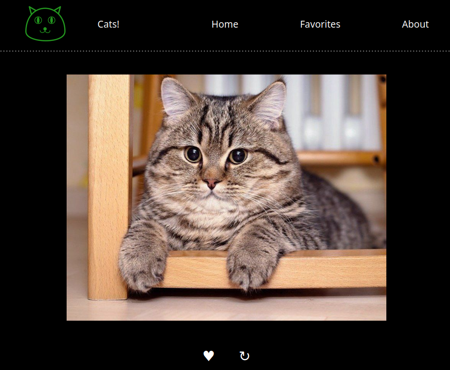

# Cats!

This project developed with Vue 3 in Vite. Just look at the cats and then add nicest and cutest to favorites!



# Credits

Project use api from https://cataas.com/ website.

# Commands

### Install packages

```sh
npm install
```

### Run for development

```sh
npm run dev
```

### Build result bundle

```sh
npm run build
```

### Lint

```sh
npm run lint
```
